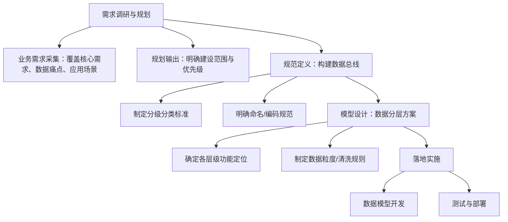
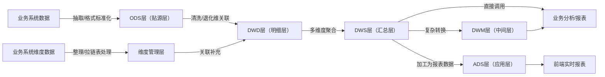

# 数据仓库分层设计案例解析

## 一、会议基本信息

|项目|内容|
|---|---|
|会议主题|数据仓库分层设计实际落地案例研讨|
|参与人员|技术团队、业务负责人、数据分析师|
|核心目标|明确数据仓库建设逻辑、核心概念界定标准、各环节实施要点，形成可落地的设计方案|
|核心产出|数据总线构建框架、数据分层设计标准、各层级实施指引|
# 二、数据仓库构建与数据总线设计

## 2.1 核心构建逻辑

数据仓库采用“自上而下”的核心构建逻辑，从企业整体业务视角统筹数据资源，通过搭建数据总线实现全域数据的分级分类管理，从源头规避数据孤岛、冗余及业务脱节问题。

## 2.2 数据总线三级架构

|架构层级|核心定义|企业实践示例（电商行业）|
|---|---|---|
|业务域（一级）|企业宏观业务板块划分，界定各业务的核心数据范围|零售业务域、供应链业务域、营销业务域|
|数据域（二级）|业务域下的细分数据范畴，归集同一业务场景的相关数据|零售业务域→线上交易数据域、线下门店数据域|
|业务过程（三级）|具体业务动作序列，是数据产生的最小单元|线上交易数据域→浏览商品、加入购物车、提交订单、支付订单|
## 2.3 落地实施步骤（流程图）

# 三、核心概念：业务域、数据域与业务过程

## 3.1 各概念详细定义与示例

|概念|核心定义|划分依据|多行业示例|
|---|---|---|---|
|业务域|企业业务的宏观分类，覆盖所有核心业务板块|组织架构、业务职能、核心目标|电商：营销域、交易域；制造：生产域、供应链域；金融：信贷域、理财域|
|数据域|业务域下的细分数据范畴，实现数据精准归集与复用|业务场景、数据用途|营销域→会员运营数据域、活动推广数据域；生产域→工序管理数据域、质量检测数据域|
|业务过程|连续的具体业务动作序列，是数据产生的核心源头|业务流程节点|会员运营→用户注册、等级升级；信贷业务→申请提交、资质审核、放款|
## 3.2 后续细化工作要求

完成三级概念梳理后，需进一步明确“数据域-业务过程-分析维度”的关联关系，具体要求如下：

- 明确核心维度：需覆盖时间（年/季/月/日）、地域（国家/省/市）、主体（用户/商品/商家）、业务属性（支付方式/商品类别）等

- 实施策略：优先梳理营销域、交易域等核心数据域，形成标准后推广至全业务域

- 示例：线上订单支付业务过程（交易数据域）→ 关联维度：支付时间、收货省份、用户会员等级、商品类别、支付渠道

# 四、数据分层设计：原因与整体架构

## 4.1 分层设计的核心价值

核心目标：提升分析效率、保障数据质量、降低管理成本。未分层时存在数据粒度混乱、冗余高、调用繁琐等问题；分层后可实现“场景-数据”精准匹配，减少重复计算。

实践对比示例：

|分析场景|未分层处理方式|分层后处理方式|效率提升|
|---|---|---|---|
|某省份月度商品销量分析|关联订单表、商品表、用户表，手动过滤无效数据、修正异常值|直接调用DWS层“月度省份商品销量汇总表”（已完成清洗聚合）|从2-3小时缩短至5-10分钟|
## 4.2 整体分层架构

标准架构包含4个核心层级，企业可根据业务复杂度灵活增设中间层（DWM）或应用层（ADS），具体架构及适配场景如下：

|架构类型|包含层级|适配企业类型|增设层级的核心目的|
|---|---|---|---|
|标准架构|维度管理层、ODS层、DWD层、DWS层|中小规模企业、业务逻辑简单|满足基础分析需求，架构简洁易维护|
|增强架构1|维度管理层、ODS层、DWD层、DWM层、DWS层|大型企业、多业务线（如金融）|处理复杂数据转换逻辑（如信贷风险评级），减轻DWD/DWS层压力|
|增强架构2|标准架构+ADS层|需实时报表支撑的企业（如电商）|存储已加工的报表数据（实时成交金额、热门商品TOP10），缩短前端响应时间|
# 五、各数据分层详细解析

## 5.1 核心分层核心信息汇总

|分层名称|英文缩写|功能定位|数据粒度|核心操作|典型产出|
|---|---|---|---|---|---|
|贴源层|ODS|数据入口，集中汇聚全域原始数据|原始细粒度|数据抽取、格式标准化（不清洗）|商品库存表、客户信息表（原始结构）|
|维度管理层|DIM|存储核心分析维度，支撑多维度分析|维度级|维度整理、拉链表处理（历史追溯）|商品类别维度表、用户会员等级拉链表|
|明细层|DWD|高质量明细数据供给层|与ODS一致（细粒度）|数据清洗、退化维设计（关联维度属性）|订单明细宽表（含商品名称、会员等级）|
|汇总层|DWS|支撑统计分析，快速响应上层需求|粗粒度（聚合后）|多维度聚合（group by）|月度省份商品销量汇总表|
## 5.2 各分层实操细节与示例

### 5.2.1 ODS层（贴源层）

- 核心原则：最小改动，保留原始数据形态，仅做必要格式转换（如时间格式统一为yyyyMMddHHmmss）

- 抽取工具选择：
        

    - 本地部署：Kettle（经典ETL工具）

    - 阿里系技术栈：Datax、NEFI

    - 公有云：阿里DTS（实时同步，稳定性高）

    - 商业化工具：data pipeline（可视化监控）

- 实践示例：某零售企业从ERP系统抽取“商品库存表”（字段：商品ID、仓库ID、库存数量、最后更新时间、是否缺货），仅统一“最后更新时间”格式，其余保留原始结构。

### 5.2.2 维度管理层

维度数据差异化处理策略：

|数据类型|处理方式|示例|
|---|---|---|
|结构稳定数据|直接抽取作为基础维度表|用户资料表、地区编码表|
|枚举类数据|标准化为两列表（ID+value）|商品类别维度表（ID：1-家电，2-服饰；value：家电、服饰）|
|状态变更数据|拉链表处理（记录生效/失效时间）|用户会员等级拉链表：普通会员（2025-01-01至2025-06-30）、黄金会员（2025-07-01至9999-12-31）|
### 5.2.3 DWD层（明细层）

核心工作分为两大模块，实操示例如下：

1. 数据清洗与标准化：

    - 剔除脏数据：删除“订单ID为空”“支付金额为负数”的记录

    - 删除垃圾数据：剔除“测试用户123”的测试订单

    - 补充缺失值：根据手机号归属地填充“收货地址”缺失的省份信息

2. 退化维设计：将维度表关键属性关联至业务表，生成宽表。最终订单明细宽表字段：订单ID、用户ID、商品ID、商品名称、商品类别、支付金额、支付时间、收货省份、会员等级。

### 5.2.4 DWS层（汇总层）

聚合逻辑与实践示例：

- 聚合维度选择：根据分析场景组合维度，常见组合：
        

    - 销售分析：时间（月度）+地域（省份）+商品（类别）

    - 用户运营：时间（日度）+用户（会员等级）

- 存储原则：同粒度数据集中存储，避免跨表查询

- 实践示例：基于DWD层订单明细宽表，按“月度+省份+商品类别”聚合，生成汇总表（字段：统计月份、省份、商品类别、订单数量、成交金额、支付用户数），业务人员可直接调取分析“2025年10月广东省家电销量”。

## 5.3 数据流转逻辑（流程图）

> （注：文档部分内容可能由 AI 生成）