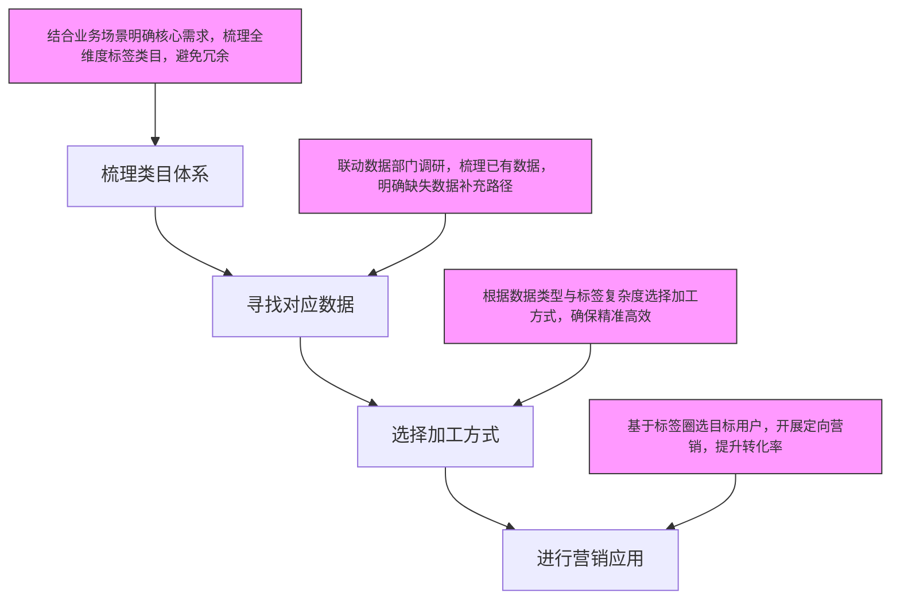

# 用户标签体系探讨：构建与应用

本文档为《用户标签体系探讨》会议的结构化记录，通过多级标题、表格、流程图等形式，系统梳理标签体系构建、分类、落地及加工等核心内容，便于快速查阅与理解。

本次会议聚焦用户标签体系的全流程构建、实际落地执行及标签加工的核心逻辑与方法，明确标签体系的建设方向与应用价值，为后续业务赋能提供支撑，具体内容如下：

## 一、标签体系构建背景与示例选择

### 1.1 构建背景

在数字化业务运营场景中，无论是面向个人用户的精准服务，还是针对企业客户的定向对接，都需要通过一套标准化、体系化的标签体系对目标实体（如人、企业）进行精准画像。不同业务领域（如电商、金融、本地生活）、不同行业及不同类型的APP，都会基于自身核心业务需求，沉淀出契合专属业务场景的标签体系，以此提升运营效率与服务精准度。

### 1.2 示例选择

为便于参会人员直观理解标签体系的构建逻辑与分类标准，本次探讨选取最具普遍性的“人的标签体系”作为核心示例，后续所有分类、层级及加工方法的讲解均围绕该示例展开。

## 二、标签体系的分类与层级

### 2.1 核心分类

结合主流业务运营需求，本次搭建的标签体系主要划分为六大核心类别，各类别核心作用与覆盖范围如下表所示：

|标签类别|核心作用|覆盖范围|
|---|---|---|
|用户属性|界定用户基础特征，提供核心画像依据|年龄、性别、城市、职业、设备状态等|
|用户行为|捕捉用户操作轨迹，判断活跃度与需求倾向|近n日/累计访问、下单、消费等行为|
|用户偏好|提炼个性化需求，支撑精准营销|购买品类、物品、访问时间偏好等|
|细分商圈|定位用户地理维度，支撑本地服务推送|居住/工作商圈、常驻城市、出行足迹等|
|细分风险控制|识别风险行为，保障平台交易安全|退货行为、异常操作、恶意刷单等|
|用户分层|实现差异化运营，精准匹配资源与权益|会员等级、生命周期、活跃度、消费水平等|
### 2.2 层级设计原则

为确保标签体系的逻辑性与可操作性，需遵循分级分类的构建原则，常见层级包括一层、两层和三层，部分复杂业务场景可延伸至更细层级。以用户属性类标签为例，具体层级结构如下：

- 一级类目：用户属性（核心维度，承载业务核心需求）

- 二级类目：职业类型、设备状态、年龄、性别等（对一级类目的具体拆解）

- 三级及以下类目：职业类型下的互联网/金融/教育行业、性别下的购物性别/自然性别等（满足精准对接需求）

## 三、各类标签体系具体内容

### 3.1 用户属性标签

作为构建用户画像的基础核心标签，主要用于界定用户的基础特征，为后续精准运营提供基础依据，具体细分维度如下：

- 人口特征：年龄（18-25岁、26-35岁等细分区间）、性别（含购物性别*注：基于消费行为判断*与自然性别*注：用户真实性别*）

- 地域特征：城市（按行政层级分为一线、新一线、二线等）

- 职业特征：涵盖互联网、金融、教育、制造等多种行业类型

- 设备特征：设备型号、系统版本、使用年限等

### 3.2 用户行为标签

聚焦用户在平台内的各类操作轨迹，是判断用户活跃度与需求倾向的关键标签，主要分为三大维度，具体内容如下：

- 近n日行为：捕捉用户短期需求，包括近5日、7日、30日、90日的访问次数、浏览页面数、加购数、下单数、购买完成情况及客单价等；

- 累计行为：衡量用户长期价值，包括累计访问、浏览、下单、购买次数及累计客单价等；

- 消费行为细节：支撑服务优化与风控管理，包括订单类别、购物品类、物流配送偏好、售后互动行为、退货率、退货异常赔付率等。

### 3.3 用户偏好标签

基于用户历史行为数据提炼的个性化需求标签，可精准匹配用户潜在消费倾向，为定时推送、精准营销提供方向，具体分为三大类：

- 购买品类偏好：数码类、生鲜类、零食类、美妆类等核心品类；

- 具体购买物品偏好：数码品类下的手机、PC、手表，汽车品类下的汽车用品等细分商品；

- 访问时间偏好：每天早高峰、午间休息、晚间黄金时段等访问高峰，以及日均访问次数、单次访问时长等。

### 3.4 用户分层标签

基于用户价值与生命周期的差异化分类标签，用于实现精细化运营，核心维度及划分标准如下表所示：

|分层维度|划分标准|
|---|---|
|RFM模型分层|基于最近消费时间、消费频率、消费金额构建|
|会员等级分层|白金、钻石、黄金、普通等级别，对应不同权益|
|生命周期分层|按用户在平台的留存时长，分为天数、月数、年数等阶段|
|流失风险分层|通过AI训练流失模型，界定已流失、高风险流失、低风险流失、未流失等状态|
|活跃度分层|划分为不活跃、一般活跃、特别活跃等层级|
|消费水平分层|按累计消费金额与客单价，分为低消费、中等消费、高消费层级|
### 3.5 风险控制标签

针对交易类商城的核心风控需求设计，用于识别用户的风险行为，保障平台交易安全。具体包括用户退货行为分析、高风险操作识别（如异常登录、批量下单）、恶意刷单行为判定等。客服人员可依据此类标签，快速判断用户投诉、售后申请等行为的合理性，提升风控响应效率与准确性。

### 3.6 商圈细分标签

依托用户APP授权的位置数据（如GPS定位精度约25米，可实现精准位置捕捉），结合用户停留时长、停留频率等数据，精准判断用户居住及工作附近的核心商圈，同时可梳理用户的常驻城市、出行足迹等地理信息，为本地生活服务推送、商圈营销活动提供精准地理维度支撑。

## 四、标签体系的落地流程

标签体系的落地需遵循标准化流程，确保各环节衔接顺畅、目标明确，具体流程如下：

### 4.1 梳理类目体系

作为标签体系落地的首要环节，需结合具体业务场景（如电商精准营销、金融风控、本地生活服务）明确核心需求，梳理出覆盖需求的全维度标签类目体系，确保每个类目都能直接支撑对应业务场景的运营或决策需求，避免标签冗余。

### 4.2 寻找对应数据

在类目体系确定后，需联动数据部门开展数据调研，梳理平台内已有数据资源，同时明确缺失数据的补充路径，最终找到能够加工出各类目标标签的数据源，确保标签加工有充足、准确的数据支撑。

### 4.3 选择加工方式

根据数据类型与标签复杂度选择合适的加工方式，主流方式及适用场景如下表所示：

|加工方式|适用场景|示例|
|---|---|---|
|编写SQL语句|简单标签加工、数据筛选与统计|用case when语句按年龄范围打分段标签|
|Python代码开发|复杂标签加工、算法模型预测类标签|构建机器学习模型预测用户性别|
|可视化配置工具操作|非技术人员操作、简单规则标签|通过配置界面设置“近7日访问3次以上”标签|
### 4.4 进行营销应用

这是标签体系落地的核心目标环节，在完成标签加工后，运营人员可基于标签进行用户圈选（如圈选“青年+数码品类偏好”用户），开展定向营销活动，如推送数码新品优惠、发送站内专属优惠券等，提升营销转化率。

### 4.5 真实流程案例：美妆品类精准营销标签体系落地

本案例以某综合电商平台“美妆品类618精准营销”为业务目标，完整呈现标签体系从需求梳理到营销落地的全流程，具体如下：

#### 4.5.1 案例背景

平台美妆品类运营团队计划在618大促期间开展精准营销活动，核心需求为：筛选出对美妆品类高意向、高价值的用户群体，推送定制化优惠券与新品信息，提升美妆品类的下单转化率与客单价，同时控制营销成本，避免对无美妆需求用户造成骚扰。

#### 4.5.2 全流程落地步骤

1. **第一步：梳理美妆专属标签类目体系**
结合“618美妆精准营销”需求，梳理出核心标签类目，聚焦用户属性、用户行为、用户偏好三大核心维度，具体类目如下：一级类目：用户属性、用户行为、用户偏好

2. 二级类目：用户属性下的年龄、性别、城市层级；用户行为下的近30日美妆相关行为、近90日美妆消费行为、累计美妆消费行为；用户偏好下的美妆品类偏好、美妆单品类型偏好、价格敏感度

3. 三级类目：年龄下的18-25岁（Z世代）、26-35岁（职场女性）；美妆品类偏好下的护肤、彩妆、香水；价格敏感度下的高端（客单价＞500元）、中端（100-500元）、低端（＜100元）等

4. **第二步：寻找对应数据源**
联动平台数据部门，确定各标签类目对应的数据源，具体对应关系如下表：

|标签类目（三级）|对应数据源|
|---|---|
|18-25岁/Z世代|用户注册信息中的年龄字段、实名认证数据|
|近30日美妆相关行为|用户近30日APP内美妆类目浏览日志、加购记录、收藏记录|
|近90日美妆消费行为|用户近90日美妆品类订单数据（含下单金额、订单数量、支付状态）|
|美妆品类偏好-护肤|用户历史护肤类商品浏览、购买、评价数据|
|价格敏感度-高端|用户历史美妆消费客单价、高端美妆品牌购买记录|
1. **第三步：选择加工方式并实现标签生成**
根据标签复杂度选择对应加工方式，核心标签加工示例如下：简单标签（年龄分层、城市层级）：采用SQL语句加工，示例SQL：`-- 生成美妆用户年龄分层标签
SELECT user_id,
CASE 
WHEN age BETWEEN 18 AND 25 THEN 'Z世代（18-25岁）'
WHEN age BETWEEN 26 AND 35 THEN '职场女性（26-35岁）'
ELSE '其他年龄层' END AS beauty_age_tag
` `FROM user_base_info;`

2. 复杂标签（美妆价格敏感度）：采用Python代码结合用户历史消费数据计算，通过聚类算法划分价格敏感度层级，核心逻辑为：基于近1年美妆消费客单价、高端品牌消费占比，使用K-Means算法聚类为高、中、低三个敏感度层级。

3. 组合标签（高意向美妆用户）：通过SQL关联多个原子标签生成，逻辑为：近30日浏览美妆页面≥5次 OR 近90日有美妆消费记录 OR 收藏美妆商品≥3件 的用户，标记为“高意向美妆用户”。

4. **第四步：开展美妆618精准营销应用**
基于加工完成的标签圈选目标用户，设计差异化营销活动：圈选用户1：Z世代（18-25岁）+ 彩妆偏好 + 中端价格敏感度，共计23万用户；推送：618彩妆新品试用装优惠券（满99减30）、彩妆套装组合优惠。

5. 圈选用户2：职场女性（26-35岁）+ 护肤偏好 + 高端价格敏感度，共计12万用户；推送：高端护肤品牌专属折扣（满1000减200）、限量版护肤礼盒预售提醒。

6. 营销效果：本次精准营销活动的美妆品类转化率达8.6%，较去年同期无标签盲推的3.2%提升168.75%，营销成本降低40%（减少对无美妆需求用户的优惠券发放）。

通过本案例可见，标签体系的标准化落地能够精准匹配业务需求，大幅提升营销效率与效果，为业务增长提供核心支撑。

## 五、标签开发与数据梳理

### 5.1 标签文档交付

标签梳理完成后，需形成标准化的标签文档，作为开发人员的核心依据。文档需明确包含以下内容：

- 层级关系：一级、二级、三级类目清晰划分；

- 标签信息：每个标签的中文名称、英文名称及详细描述；

- 计算逻辑：明确标签的数据来源、加工规则、更新频率。

完成后将文档交付给标签开发人员（通常为数据产品经理或数据分析师）。

### 5.2 数据分类盘点

标签加工依赖全面、高质量的数据，因此需开展系统的数据分类盘点工作。盘点范围覆盖静态数据与动态数据两大类，具体如下：

- 静态数据：用户人口属性、商业属性、消费意向等相对固定的信息；

- 动态数据：用户实时行为数据、场景数据、媒体交互数据、路径轨迹数据等实时变化的信息。

通过盘点明确各类数据的存储位置、格式、质量及可复用性，为后续标签加工扫清数据障碍。

## 六、标签加工核心概念

### 6.1 原子标签与组合标签

标签按加工逻辑可分为原子标签与组合标签，两者的定义、特点及示例对比如下：

|标签类型|定义|特点|示例|
|---|---|---|---|
|原子标签|最基础、不可再拆分的标签，直接基于原始数据加工得到|结构简单、加工难度低、通用性强|性别（男/女）、消费能力（低/中/高）|
|组合标签|通过多个原子标签的逻辑组合生成|精准度高、针对性强、适配细分场景|男性+高消费能力、青年+生鲜偏好|
### 6.2 算法模型预测

针对部分用户未主动填写的核心信息（如性别、职业），可采用算法模型预测的方式生成标签，具体流程如下：

- 数据收集：收集用户历史行为数据（如浏览商品类型、消费偏好、访问时间等）作为训练样本；

- 模型构建：使用Python编程语言及主流机器学习算法框架（如Tensorflow、Caffe、Paddle等）构建预测模型；

- 模型训练：通过训练样本优化模型参数，提升预测准确率；

- 标签生成：对未填写目标信息的用户进行属性预测，最终生成对应的标签。
> （注：文档部分内容可能由 AI 生成）